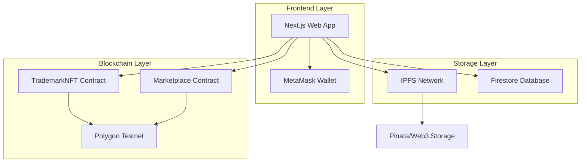
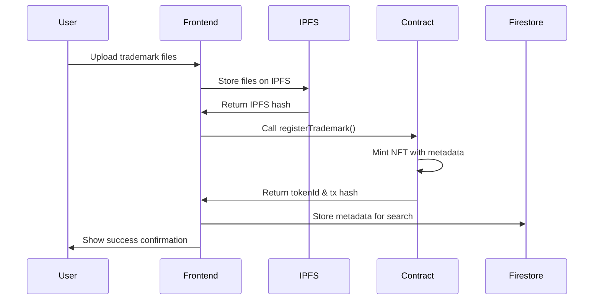
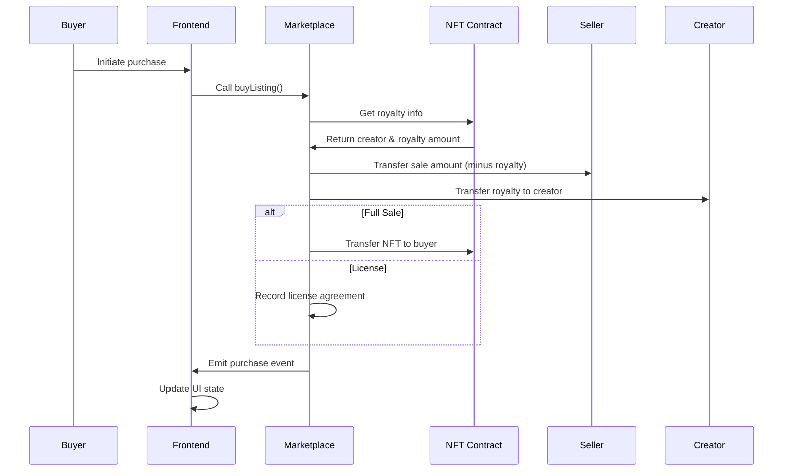

# Design Document

## Overview

The Trademark NFT Marketplace is a decentralized application built on Polygon testnet that enables intellectual property registration, trading, and licensing through blockchain technology. The system combines smart contracts for on-chain logic, IPFS for decentralized storage, and a modern web interface for user interactions.

## Architecture

### High-Level Architecture



### Technology Stack

- **Blockchain**: Polygon Mumbai/Amoy testnet for low-cost transactions
- **Smart Contracts**: Solidity with Hardhat development framework
- **Frontend**: Next.js 14 with TypeScript and Tailwind CSS
- **Web3 Integration**: ethers.js v6 for blockchain interactions
- **Storage**: IPFS via Pinata or Web3.Storage for asset files
- **Database**: Firebase Firestore for metadata and user profiles
- **Authentication**: Web3 wallet-based authentication (MetaMask)

## Components and Interfaces

### Smart Contracts

#### TrademarkNFT Contract (ERC721)

```solidity
contract TrademarkNFT is ERC721, ERC721URIStorage, Ownable {
    struct Trademark {
        uint256 tokenId;
        address creator;
        string ipfsHash;
        string category;
        uint96 royaltyBps; // Basis points (100 = 1%)
        uint256 createdAt;
    }
    
    mapping(uint256 => Trademark) public trademarks;
    uint256 private _tokenIdCounter;
    
    function registerTrademark(
        string memory ipfsHash,
        string memory category,
        uint96 royaltyBps,
        string memory tokenURI
    ) external returns (uint256);
    
    function getTrademarkInfo(uint256 tokenId) external view returns (Trademark memory);
    function getRoyaltyInfo(uint256 tokenId, uint256 salePrice) external view returns (address, uint256);
}
```

#### Marketplace Contract

```solidity
contract TrademarkMarketplace {
    struct Listing {
        uint256 listingId;
        uint256 tokenId;
        address seller;
        uint256 price;
        bool isLicense;
        bool active;
        uint256 createdAt;
    }
    
    mapping(uint256 => Listing) public listings;
    mapping(uint256 => uint256[]) public tokenListings; // tokenId => listingIds
    uint256 private _listingIdCounter;
    
    function createListing(
        uint256 tokenId,
        uint256 price,
        bool isLicense
    ) external returns (uint256);
    
    function buyListing(uint256 listingId) external payable;
    function cancelListing(uint256 listingId) external;
    function getActiveListings() external view returns (Listing[] memory);
}
```

### Frontend Components

#### Core Pages Structure

```
pages/
├── index.tsx                 # Landing page
├── dashboard/
│   ├── index.tsx            # Creator dashboard
│   └── register.tsx         # Trademark registration form
├── marketplace/
│   ├── index.tsx            # Marketplace browse
│   └── [id].tsx             # Trademark detail view
└── api/
    └── upload.ts            # IPFS upload endpoint
```

#### Key React Components

```typescript
// Web3 Context for wallet management
interface Web3ContextType {
  account: string | null;
  contract: TrademarkNFT | null;
  marketplace: TrademarkMarketplace | null;
  connect: () => Promise<void>;
  disconnect: () => void;
}

// Trademark registration form
interface TrademarkFormData {
  title: string;
  description: string;
  category: string;
  royaltyPercentage: number;
  files: File[];
}

// Marketplace listing component
interface ListingCardProps {
  listing: Listing;
  trademark: Trademark;
  onBuy: (listingId: number) => Promise<void>;
}
```

### IPFS Integration

#### Upload Flow

1. **Client-side upload**: Files uploaded directly from browser to IPFS
2. **Metadata creation**: JSON metadata with trademark details
3. **Hash storage**: IPFS hash stored in smart contract and Firestore

```typescript
interface IPFSMetadata {
  name: string;
  description: string;
  image: string; // IPFS hash of main asset
  attributes: {
    category: string;
    creator: string;
    createdAt: string;
  }[];
  files: string[]; // Array of IPFS hashes for additional files
}
```

### Database Schema (Firestore)

#### Collections Structure

```typescript
// users collection
interface UserProfile {
  address: string;
  displayName?: string;
  email?: string;
  createdAt: Timestamp;
  totalTrademarks: number;
  totalSales: number;
}

// trademarks collection
interface TrademarkMetadata {
  tokenId: number;
  creatorAddress: string;
  title: string;
  description: string;
  category: string;
  ipfsHash: string;
  royaltyPercentage: number;
  createdAt: Timestamp;
  transactionHash: string;
}

// listings collection
interface ListingMetadata {
  listingId: number;
  tokenId: number;
  sellerAddress: string;
  price: string; // Wei amount as string
  isLicense: boolean;
  active: boolean;
  createdAt: Timestamp;
  transactionHash: string;
}

// transactions collection
interface TransactionRecord {
  id: string;
  type: 'registration' | 'listing' | 'sale' | 'license';
  tokenId: number;
  fromAddress: string;
  toAddress: string;
  amount?: string;
  royaltyAmount?: string;
  transactionHash: string;
  createdAt: Timestamp;
}
```

## Data Models

### Smart Contract Data Flow



### Marketplace Transaction Flow



## Error Handling

### Smart Contract Error Handling

- **Access Control**: Only token owners can list their NFTs
- **Payment Validation**: Exact payment amount required for purchases
- **State Validation**: Listings must be active and not expired
- **Royalty Limits**: Royalty percentage capped at 25% (2500 basis points)

### Frontend Error Handling

- **Wallet Connection**: Graceful handling of wallet rejection/disconnection
- **Transaction Failures**: User-friendly error messages with retry options
- **Network Issues**: Automatic retry with exponential backoff
- **IPFS Failures**: Fallback to alternative IPFS gateways

### Common Error Scenarios

```typescript
enum ErrorTypes {
  WALLET_NOT_CONNECTED = 'Please connect your wallet',
  INSUFFICIENT_FUNDS = 'Insufficient funds for transaction',
  TRANSACTION_REJECTED = 'Transaction was rejected',
  IPFS_UPLOAD_FAILED = 'Failed to upload files to IPFS',
  CONTRACT_ERROR = 'Smart contract execution failed',
  NETWORK_ERROR = 'Network connection error'
}
```

## Testing Strategy

### Smart Contract Testing

- **Unit Tests**: Individual function testing with Hardhat
- **Integration Tests**: Full workflow testing (register → list → buy)
- **Gas Optimization**: Transaction cost analysis and optimization
- **Security Audits**: Static analysis with Slither and manual review

### Frontend Testing

- **Component Tests**: React component testing with Jest and React Testing Library
- **Integration Tests**: End-to-end user flows with Playwright
- **Web3 Mocking**: Mock wallet and contract interactions for isolated testing
- **IPFS Testing**: Mock IPFS uploads for consistent test environments

### Test Coverage Goals

- Smart contracts: 95% line coverage
- Frontend components: 80% line coverage
- Critical user flows: 100% end-to-end coverage

### Performance Considerations

- **IPFS Caching**: Implement IPFS gateway caching for faster asset loading
- **Database Indexing**: Firestore composite indexes for efficient queries
- **Lazy Loading**: Progressive loading of marketplace listings
- **Transaction Batching**: Batch multiple operations where possible

### Security Measures

- **Input Validation**: Comprehensive validation on both frontend and contract level
- **Reentrancy Protection**: Use OpenZeppelin's ReentrancyGuard
- **Access Control**: Role-based permissions with proper ownership checks
- **Rate Limiting**: Prevent spam transactions and uploads