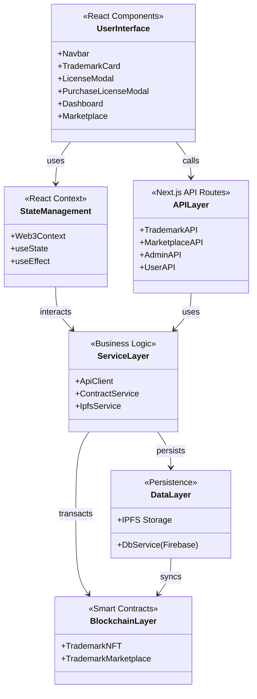
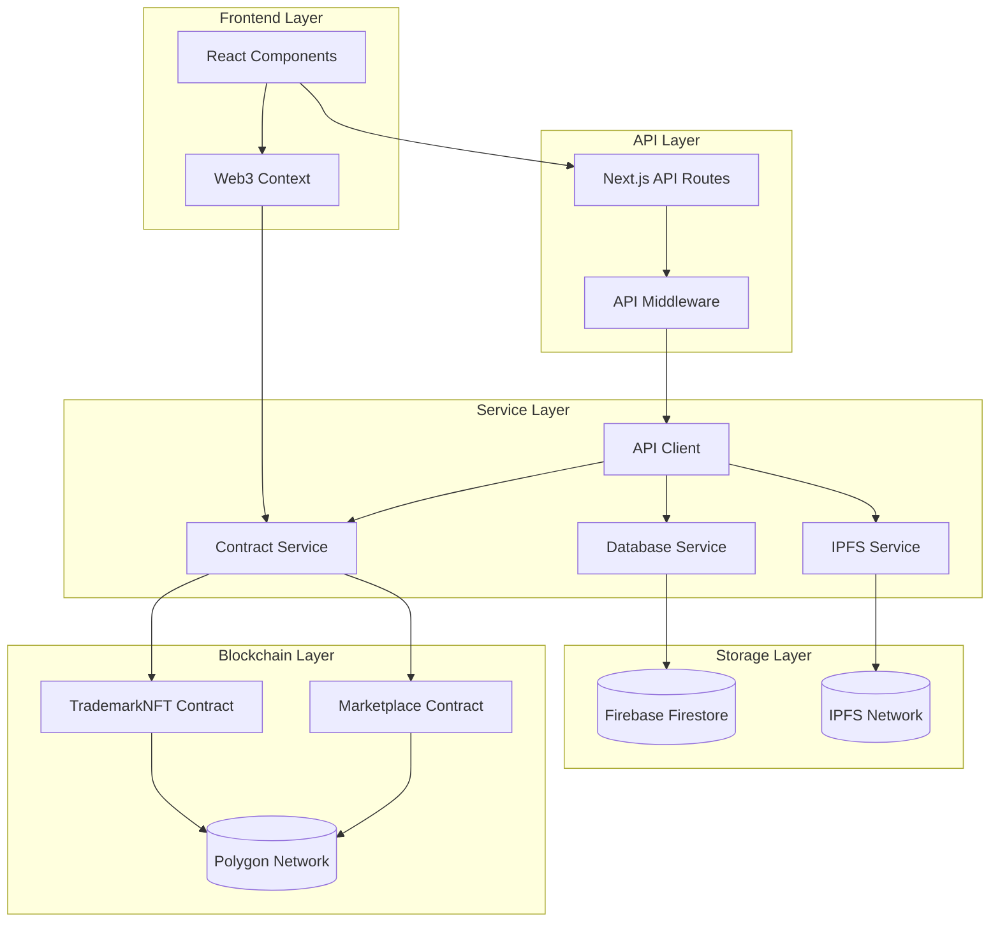

# TrademarkChain - Class Diagram

## System Architecture Class Diagram

```mermaid
classDiagram
    %% Smart Contracts Layer
    class TrademarkNFT {
        -Counters.Counter _tokenIdCounter
        -string _baseTokenURI
        -uint96 _defaultRoyaltyBps
        +mint(to: address, ipfsHash: string, category: string, royaltyBps: uint96) uint256
        +setTokenRoyalty(tokenId: uint256, receiver: address, royaltyBps: uint96)
        +getTrademarkInfo(tokenId: uint256) Trademark
        +royaltyInfo(tokenId: uint256, salePrice: uint256) (address, uint256)
        +tokenURI(tokenId: uint256) string
    }

    class TrademarkMarketplace {
        -Counters.Counter _listingIdCounter
        -TrademarkNFT trademarkNFT
        -uint96 marketplaceFee
        -mapping~uint256-Listing~ listings
        -mapping~uint256-uint256[]~ tokenListings
        -mapping~address-uint256[]~ sellerListings
        -mapping~uint256-License[]~ tokenLicenses
        +createListing(tokenId: uint256, price: uint256, isLicense: bool, duration: uint256, expiresAt: uint256) uint256
        +buyTrademark(listingId: uint256)
        +licenseTrademark(listingId: uint256, duration: uint256)
        +cancelListing(listingId: uint256)
        +getActiveListingsForToken(tokenId: uint256) uint256[]
        +hasActiveLicense(tokenId: uint256, user: address) bool
        +updateMarketplaceFee(newFee: uint96)
    }

    class Ownable {
        <<OpenZeppelin>>
        -address _owner
        +owner() address
        +transferOwnership(newOwner: address)
        +renounceOwnership()
    }

    class ReentrancyGuard {
        <<OpenZeppelin>>
        -uint256 _status
        +nonReentrant()
    }

    class ERC721 {
        <<OpenZeppelin>>
        +balanceOf(owner: address) uint256
        +ownerOf(tokenId: uint256) address
        +transferFrom(from: address, to: address, tokenId: uint256)
        +approve(to: address, tokenId: uint256)
    }

    class ERC2981 {
        <<OpenZeppelin>>
        +royaltyInfo(tokenId: uint256, salePrice: uint256) (address, uint256)
    }

    %% Frontend Context Layer
    class Web3Context {
        -account: string | null
        -chainId: number | null
        -isConnected: boolean
        -isLoading: boolean
        +connect() Promise~void~
        +disconnect() void
        +switchNetwork() Promise~void~
        +checkConnection() Promise~void~
        +handleAccountsChanged(accounts: string[])
        +handleChainChanged(chainId: string)
    }

    %% Type Definitions
    class Trademark {
        +tokenId: number
        +creator: string
        +ipfsHash: string
        +category: string
        +royaltyBps: number
        +createdAt: number
    }

    class Listing {
        +listingId: number
        +tokenId: number
        +seller: string
        +price: string
        +isLicense: boolean
        +duration?: number
        +active: boolean
        +createdAt: number
        +expiresAt?: number
    }

    class License {
        +licenseId: number
        +tokenId: number
        +licensee: string
        +licensor: string
        +price: string
        +duration: number
        +issuedAt: number
        +expiresAt: number
        +active: boolean
    }

    class SloganFormData {
        +companyName: string
        +sloganText: string
        +registrationNumber: string
        +category: string
        +description: string
        +royaltyPercentage: number
        +language: string
        +usageContext: string
        +files: File[]
    }

    class SloganMetadata {
        +tokenId: number
        +creatorAddress: string
        +companyName: string
        +sloganText: string
        +registrationNumber: string
        +category: string
        +description: string
        +ipfsHash: string
        +royaltyPercentage: number
        +createdAt: Date
        +transactionHash: string
        +verified: boolean
        +language?: string
        +usageContext?: string
    }

    class UserProfile {
        +address: string
        +companyName?: string
        +displayName?: string
        +email?: string
        +createdAt: Date
        +totalTrademarks: number
        +totalProducts: number
        +verified: boolean
    }

    class Report {
        +id: string
        +type: ReportType
        +targetId: string
        +targetType: TargetType
        +reason: string
        +description?: string
        +reporterAddress: string
        +status: ReportStatus
        +resolution?: string
        +resolvedBy?: string
        +resolvedAt?: Date
        +createdAt: Date
        +updatedAt: Date
    }

    %% Service Layer
    class ApiClient {
        +registerTrademark(data: SloganFormData) Promise~ApiResponse~
        +getTrademark(id: string) Promise~SloganMetadata~
        +getTrademarks(filters?: object) Promise~SloganMetadata[]~
        +verifyTrademark(id: string) Promise~VerificationResult~
        +createListing(data: object) Promise~ApiResponse~
        +purchaseLicense(listingId: string) Promise~ApiResponse~
        +getUserProfile(address: string) Promise~UserProfile~
        +createReport(data: Report) Promise~ApiResponse~
    }

    class DbService {
        -db: Firestore
        +saveTrademark(data: SloganMetadata) Promise~void~
        +getTrademark(id: string) Promise~SloganMetadata~
        +updateTrademark(id: string, data: Partial~SloganMetadata~) Promise~void~
        +saveUser(data: UserProfile) Promise~void~
        +getUser(address: string) Promise~UserProfile~
        +saveListing(data: Listing) Promise~void~
        +getListing(id: string) Promise~Listing~
        +saveLicense(data: License) Promise~void~
        +getUserLicenses(address: string) Promise~License[]~
        +saveReport(data: Report) Promise~void~
        +getReports(filters?: object) Promise~Report[]~
    }

    class IpfsService {
        +uploadFile(file: File) Promise~string~
        +uploadMetadata(metadata: IPFSMetadata) Promise~string~
        +getFile(hash: string) Promise~Blob~
        +getMetadata(hash: string) Promise~IPFSMetadata~
    }

    class ContractService {
        -provider: BrowserProvider
        -trademarkNFT: Contract
        -marketplace: Contract
        +mintTrademark(ipfsHash: string, category: string, royaltyBps: number) Promise~number~
        +createListing(tokenId: number, price: string, isLicense: boolean, duration: number) Promise~number~
        +buyTrademark(listingId: number, price: string) Promise~void~
        +licenseTrademark(listingId: number, price: string, duration: number) Promise~void~
        +getTrademarkInfo(tokenId: number) Promise~Trademark~
        +getListingInfo(listingId: number) Promise~Listing~
        +hasActiveLicense(tokenId: number, user: string) Promise~boolean~
    }

    %% Component Layer
    class Navbar {
        -account: string | null
        -isConnected: boolean
        -isMobileMenuOpen: boolean
        -searchQuery: string
        -error: string | null
        +handleConnect() Promise~void~
        +handleSearch(e: FormEvent) void
        +handleBack() void
    }

    class TrademarkCard {
        +trademark: SloganMetadata
        +onClick?: Function
        +showActions?: boolean
        +render() JSX.Element
    }

    class LicenseModal {
        +isOpen: boolean
        +trademark: SloganMetadata
        +onClose: Function
        +onSubmit: Function
        +render() JSX.Element
    }

    class PurchaseLicenseModal {
        +isOpen: boolean
        +listing: Listing
        +onClose: Function
        +onPurchase: Function
        +render() JSX.Element
    }

    class ProductVerification {
        +tokenId?: number
        +registrationNumber?: string
        +onVerify: Function
        +render() JSX.Element
    }

    %% API Routes
    class TrademarkAPI {
        +GET /api/trademarks
        +POST /api/trademarks
        +GET /api/trademarks/[id]
        +PUT /api/trademarks/[id]
        +DELETE /api/trademarks/[id]
    }

    class MarketplaceAPI {
        +GET /api/marketplace/listings/[id]
        +POST /api/marketplace/purchase
        +POST /api/marketplace/license
    }

    class AdminAPI {
        +POST /api/admin/verify-trademark
        +POST /api/admin/reject-trademark
        +POST /api/admin/suspend-user
        +POST /api/admin/suspend-listing
        +GET /api/admin/reports
    }

    class UserAPI {
        +GET /api/users/[address]
        +POST /api/users/[address]
    }

    %% Relationships - Inheritance
    TrademarkNFT --|> ERC721
    TrademarkNFT --|> ERC2981
    TrademarkNFT --|> Ownable
    TrademarkMarketplace --|> ReentrancyGuard
    TrademarkMarketplace --|> Ownable

    %% Relationships - Composition
    TrademarkMarketplace *-- TrademarkNFT : uses
    TrademarkMarketplace *-- Listing : manages
    TrademarkMarketplace *-- License : manages
    
    %% Relationships - Association
    Web3Context ..> ContractService : uses
    ContractService ..> TrademarkNFT : interacts
    ContractService ..> TrademarkMarketplace : interacts
    
    ApiClient ..> DbService : uses
    ApiClient ..> IpfsService : uses
    ApiClient ..> ContractService : uses
    
    DbService ..> SloganMetadata : stores
    DbService ..> UserProfile : stores
    DbService ..> Listing : stores
    DbService ..> License : stores
    DbService ..> Report : stores
    
    Navbar ..> Web3Context : uses
    TrademarkCard ..> SloganMetadata : displays
    LicenseModal ..> SloganMetadata : uses
    PurchaseLicenseModal ..> Listing : uses
    
    TrademarkAPI ..> DbService : uses
    MarketplaceAPI ..> DbService : uses
    AdminAPI ..> DbService : uses
    UserAPI ..> DbService : uses
    
    %% Data Flow
    SloganFormData ..> SloganMetadata : transforms to
    Trademark ..> SloganMetadata : maps to
```

## Component Interaction Diagram

## Data Flow Diagram

## Key Design Patterns

### 1. **Repository Pattern**
- `DbService` acts as a repository for all database operations
- Abstracts Firebase implementation details from business logic

### 2. **Service Layer Pattern**
- `ApiClient`, `ContractService`, `IpfsService` provide clean interfaces
- Separates business logic from presentation and data layers

### 3. **Context Pattern**
- `Web3Context` manages global wallet state
- Provides centralized Web3 functionality across components

### 4. **Factory Pattern**
- Smart contracts use factory pattern for creating NFTs and listings
- Counters generate unique IDs for entities

### 5. **Observer Pattern**
- Smart contract events notify frontend of state changes
- React hooks observe context changes

## Technology Stack

| Layer | Technology |
|-------|-----------|
| Smart Contracts | Solidity 0.8.19, OpenZeppelin |
| Blockchain | Polygon (Mumbai/Mainnet) |
| Frontend | Next.js 14, React, TypeScript |
| Styling | Tailwind CSS |
| Web3 | Ethers.js v6 |
| Storage | Firebase Firestore, IPFS |
| API | Next.js API Routes |
| State | React Context API |

## Security Features

- **ReentrancyGuard**: Prevents reentrancy attacks on marketplace
- **Ownable**: Access control for admin functions
- **Input Validation**: All inputs validated on contract and API level
- **Rate Limiting**: API middleware prevents abuse
- **Wallet Authentication**: Blockchain-based authentication
- **IPFS Content Addressing**: Immutable content storage

